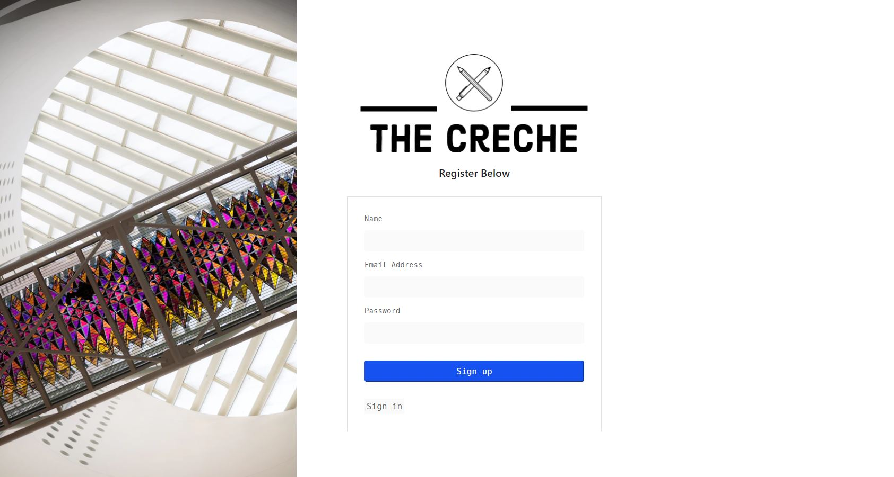
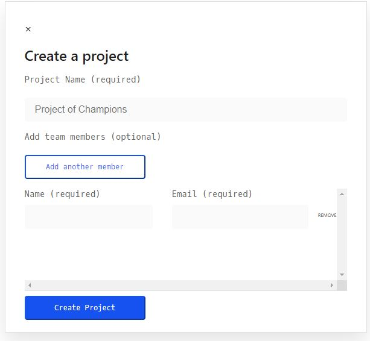

# The Creche 

  [](https://opensource.org/licenses/MIT)

  ## Table of Contents
  - [Description](#description)
  - [Technologies](#technologies)
  - [Installation](#installation)
  - [Usage Information](#usage-information)
  - [License](#license)
  - [Contribution Guidelines](#contribution-guidelines)
  - [Test Procedure](#test-procedure)
  - [Questions](#questions)
  - [Images](#images)

  ## Description
  The Creche is a MERN stack web based internal project management application. Designed to help teams keep across projects they are currently working on and assign employees to those projects. Also allows for manager to keep across who is working on what taks on the project and give due dates for those tasks.

  Able to register and login securely to keep those sensitive projects safe!

  Visit [The Creche](https://the-creche.herokuapp.com/) here!

  ```
  Test Account
  - Email: test@email.com
  - Password: test123
  ```

  ## Technologies

  <b><u>Front End</u></b>
  - Moment - validating, manipulating and formatting dates
  - Axios - promise based HTTP client
  - React including react-dom, react-redux, react-router-dom
  - Redux
  - SASS - for styling
  - Material UI - for icons

  <b><u>Back End</u></b>
  - Bcryptjs - hashing passwords
  - Express
  - Mongoose
  - Passport - authentication middleware for Node.js
  - JSONwebtoken

  ## Installation
  ```
  - npm run full-install 
  - npm run dev
  ```
  Server runs on http://localhost:5000 and client runs on http://localhost:3000

  ## Future Implementations

  - Multi-user login - allow each department have access to their own dashboard, specific to them
  - Email notifications - get notified about the projects you are assigned to and about upcoming due dates for tasks
  - Internal chat & video conferencing
  - Link to the CRM that you use

  ## Usage Information
  Use this application to keep across projects and tasks

  ## License
  MIT

  ## Contribution Guidelines
  Contribute freely

  ## Test Procedure
  n/a

  ## Questions
  If you have any questions, then feel free to contact me on the below:
  - Github: [bdjm94](https://github.com/bdjm94)
  - Email: [brendandjmoore@gmail.com](brendandjmoore@gmail.com)

  ## Images
| Login Page |
|------------|
  

| Register Page |
|------------|
  

| Dashboard View |
|------------|
  

| New Project |
|------------|
  

| Task View |
|------------|
  

| New Task |
|------------|
  